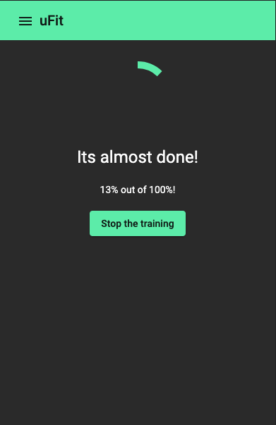

# [FitApp](https://fit-app-c4432.web.app/training)

## Screenshots from the project:

This project was generated with [Angular CLI](https://github.com/angular/angular-cli) version 13.3.6.

## Development server

Run `ng serve` for a dev server. Navigate to `http://localhost:4200/`. The application will automatically reload if you change any of the source files.

